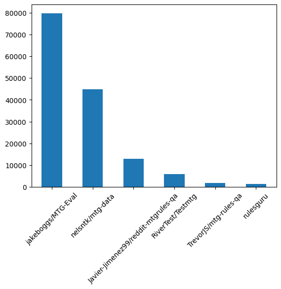
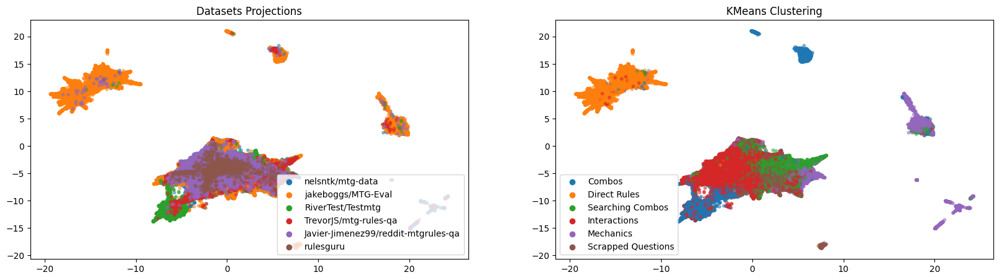

# 🧙‍♂ Gatherer Sage: Training a LLM on Magic: The Gathering Data ✨
Welcome to **Gatherer Sage**, an open-source side project where a love for **Magic: The Gathering** meets the world of **Large Language Models (LLMs)**. If you’re a fan of Magic and also intrigued by the power of AI, you’re in the right place! 😄

## ⚠️ Disclaimer: Work in Progress 🛠️

Gatherer Sage is still a **work in progress** and evolving every day! 😅 Expect bugs, incomplete features, and some messy code here and there. I'm actively working on improving the project, so if something looks a bit chaotic, don’t worry—it’s part of the process! More updates and refinements are on the way, and any feedback or contributions are super appreciated! 🙌


## 🎯 Why Gatherer Sage?
Magic has always been more than a game to me—it's a universe where creativity, strategy, and mathematics collide in a beautiful way. One day, while sleeving my favorite Selesnya deck 🌳☀️, I thought: "What if a machine could understand Magic?" Not just the cards, but the subtle dynamics between them, the synergies, and even the meta!

And so, Gatherer Sage came to life! Initially, the goal was to create an AI that could assist with rulings during casual games without a judge, helping to clarify tricky interactions. But as I delved deeper, I realized the potential for the model to do much more. Now, the aim is not only to support rulings but also to assist with drafting, deck analysis, and even understanding complex card synergies, helping players improve their gameplay or, at the very least, have some fun experimenting with AI! 🤖✨

---

## 📜 Table of Contents

1. [Overview](#overview)
2. [Dataset](#dataset)

---

## 1. 🔍 Overview

Gatherer Sage is an AI-powered project that leverages the power of **transformer-based models** (think GPT) to understand and interact with **Magic: The Gathering** data. It's trained on card text, set details, and other Magic metadata to provide insights and even assist in decision-making within the game.

This project is still in its early stages, but the dream is for it to eventually:
- Help with **draft strategies** based on current metas.
- Assist in **deck-building** with synergy suggestions and balance recommendations.
- Help with **rulings** during casual games.
- Analyze **game states** to give actionable tips during matches.
- And much more!

---

## 2. 📊 Dataset
### 2.1. Reddit QA Dataset
I have created a dataset that contains **~12.8K** questions asked in the [r/mtgrules](https://www.reddit.com/r/mtgrules/) subreddit from September 1, 2019, to December 31, 2022. It primarily focuses on card rulings and interactions in **Magic: The Gathering** 🧙‍♂️✨.

The dataset has been filtered to include only question-answer pairs where the answers have at least 1 upvote. If multiple answers were available, the one with the highest vote count was selected.

The raw data is available in the [./data/reddit/](./data/reddit/) folder, and the processed dataset can be obtained from [Javier-Jimenez99/reddit-mtgrules-qa](https://huggingface.co/datasets/Javier-Jimenez99/reddit-mtgrules-qa).

### 2.2. Full Corpus
The full corpus used for training the model includes **145K** question-answer pairs from multiple sources, including:
1. **[nelsntk/mtg-data](https://huggingface.co/datasets/nelsntk/mtg-data)**
2. **[jakeboggs/MTG-Eval](https://huggingface.co/datasets/jakeboggs/MTG-Eval)**
3. **[RiverTest/Testmtg](https://huggingface.co/datasets/RiverTest/Testmtg)**
4. **[TrevorJS/mtg-rules-qa](https://huggingface.co/datasets/TrevorJS/mtg-rules-qa)**
5. **[Javier-Jimenez99/reddit-mtgrules-qa](https://huggingface.co/datasets/Javier-Jimenez99/reddit-mtgrules-qa)**

This is the distribution of the dataset:



I have proyected all the data using PCA algorithm to visualize it in 2D. After applying K-means algorithm to the data, I have obtained clearly defined clusters. This shows that the data is well distributed and the model will be able to learn from different sources.



### 2.3. Dataset Versions and Filtering

To accommodate various research needs and computational resources, we have created multiple versions of the dataset containing **145K**, **70K**, **35K**, and **10K** question-answer pairs. To reduce the dataset size while maintaining high quality and diversity, we employed a method called **Superfiltering-D**, which is a combination of superfiltering and a diversity filter.

- **Superfiltering:** Is a data preprocessing technique desribed in the paper [Superfiltering: Weak-to-Strong Data Filtering for Fast Instruction-Tuning](https://github.com/tianyi-lab/Superfiltering). It selects high-quality data for instruction tuning by leveraging **weaker language models** (like GPT-2) to filter data that will be used to fine-tune stronger models. The key insight is that while weak and strong models differ greatly in their overall performance, they show consistent ability in ranking the difficulty of instructions.

- **Diversity Filter:** Using **Facility Location**, it ensures that the dataset maintains a broad range of topics and scenarios within the MTG domain. By filtering out overly similar question-answer pairs, it increases the variety and richness of the dataset, which is beneficial for training models that generalize well across different types of queries.

The filtered datasets are available in:
- **[Javier-Jimenez99/mtg-qa-145K-corpus](https://huggingface.co/datasets/Javier-Jimenez99/mtg-qa-145K-corpus)**
- **[Javier-Jimenez99/mtg-qa-70K-corpus](https://huggingface.co/datasets/Javier-Jimenez99/mtg-qa-70K-corpus)**
- **[Javier-Jimenez99/mtg-qa-35K-corpus](https://huggingface.co/datasets/Javier-Jimenez99/mtg-qa-35K-corpus)**
- **[Javier-Jimenez99/mtg-qa-10K-corpus](https://huggingface.co/datasets/Javier-Jimenez99/mtg-qa-10K-corpus)**

---

📚 You can find a list of resources that were helpful during the development of this project in the [useful-resources.md](./useful-resources.md) file.

## Setup

Installation Advices:
```
FLASH_ATTENTION_SKIP_CUDA_BUILD=TRUE pip install flash-attn --no-build-isolation`
```
